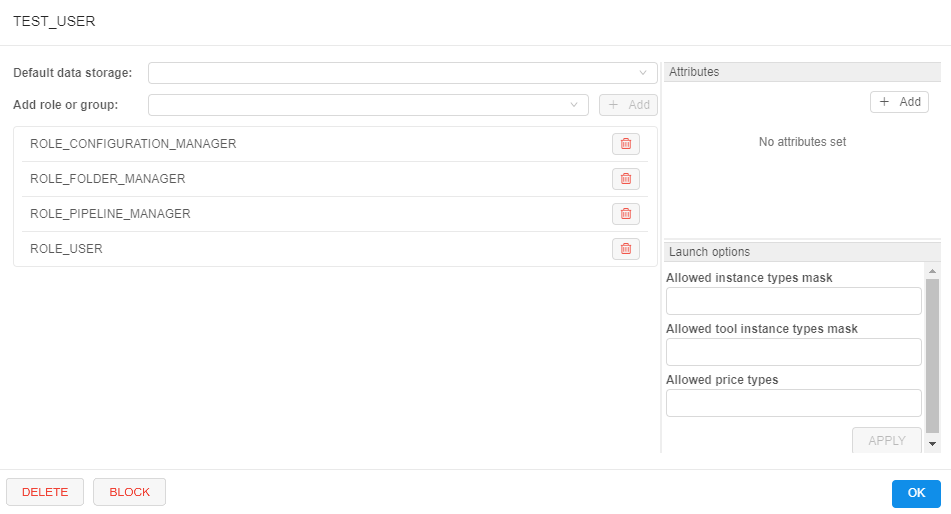
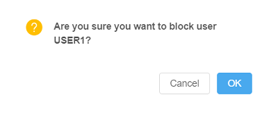

# 12.4. Edit/delete a user

- [Edit a user](#edit-a-user)
    - [Default data storage](#default-data-storage)
    - [Groups (roles) management](#groups-roles-management)
    - [Attributes](#attributes)
    - [Launch options](#launch-options)
- [Block/unblock a user](#blockunblock-a-user)
- [Delete a user](#delete-a-user)

> User shall have **ROLE\_ADMIN** to edit/delete users.

## Edit a user

For edit a user:

1. Open **Users** tab on **User management** section of system-level settings.
2. Find a user.
3. Click **Edit** button in the row opposite the user name:  
    
4. Pop-up window will be shown:  
    

On this form there are several blocks of the settings for a user.

### Default data storage

Here you can select default data storage for a user:  

### Groups (roles) management

In this block you can set groups and roles for the selected user:  

For more information about changing a set of the roles/groups for the specific user see [12.8. Change a set of roles/groups for a user](12.8._Change_a_set_of_roles_groups_for_a_user.md#change-a-set-of-roles-and-groups-to-a-selected-user).

### Attributes

In this block you can set metadata tags (attributes) for a user. These tags represent key/value pairs, same as pipeline/folder tags. For more information see [17. CP objects tagging by additional attributes](../17_Tagging_by_attributes/17._CP_objects_tagging_by_additional_attributes.md).

#### "Blocking" notifications track

One of the special attribute that is set automatically - information about the notifications confirmation:  
      
Via that attribute you can view, which "blocking" notifications were confirmed by the user (about system notifications see [here](12._Manage_Settings.md#system-events)).  
This attribute is shown only for users that confirmed at least one "blocking" notification.  
By default, this attribute has the following pair:

- _KEY_ - `confirmed_notifications` (that name could be changed via the system-level preference **`system.events.confirmation.metadata.key`**)
- _VALUE_ - link that shows summary count of confirmed notifications for the user

To open the detailed table with confirmed notifications for the user:

1. Click the _VALUE_ link:  
      
2. Here you can view detailed information about confirmed notifications - their titles, messages and datetime of the confirmation:  
      
3. Also you can open "raw" `JSON` view of the detailed table, if necessary. For that, click the **EDIT** button under the detailed table:  
      
4. Here you can edit the contents. Click the **SAVE** button to save changes:  
      

### Launch options

In this block you can specify some restrictions for a user on allowed instance types and price types.
Here you can specify:

| Field | Description | Example |
|---|---|---|
| **Allowed instance types mask** | This mask restrict for a specific user allowed instance types for launching tools, pipelines and configurations | If you want user will be able to launch runs with only "m5..." instances types, mask would be **`m5*`**:  In that case, before launching tool, pipeline or configuration, dropdown list of available node types will be look like this:  |
| **Allowed tool instance types mask** | This mask restrict for a specific user allowed instance types only for tools - launching from tools menu or main dashboard. This mask has higher priority for launching tool than **Allowed instance types mask**. It's meaning that in case when both masks are set - for the launching tool will be applied **Allowed tool instance types mask**. | If you want user will be able to launch tools with only some of "large m5..." instances types, mask would be **`m5*.large*`**:  In that case, before launching tool, dropdown list of available node types will be look like this:  |
| **Allowed price types** | In this field you may restrict, what price types will be allowed for a user. | If you want user will be able to launch only "On-demand" runs, select it in the dropdown list:  In that case, before launching tool, dropdown list of price types will be look like this:  |

To apply set restrictions for a user click 

Setting restrictions on allowed instance types/price types is a convenient way to minimize a number of invalid configurations runs.  
Such restrictions could be set not only for a user, but on another levels too.  
In CP platform next hierarchy is set for applying of inputted allowed instance types (sorted by priority):

- User level (specified for a user on "User management" tab) (see [above](#launch-options))
- User group level (specified for a group (role) on "User management" tab. If a user is a member of several groups - list of allowed instances will be summarized across all the groups) (see [v.0.14 - 12.6. Edit a group/role](12.6._Edit_a_group_role.md#launch-options))
- Tool level (specified for a tool on "Instance management" panel) (see [v.0.14 - 10.5. Launch a Tool](../10_Manage_Tools/10.5._Launch_a_Tool.md#instance-management))
- _(global)_ **`cluster.allowed.instance.types.docker`** (specified on "Cluster" tab in "Preferences" section of system-level settings) (see [v.0.14 - 12.10. Manage system-level settings](12.10._Manage_system-level_settings.md#cluster))
- _(global)_ **`cluster.allowed.instance.types`** (specified on "Cluster" tab in "Preferences" section of system-level settings) (see [v.0.14 - 12.10. Manage system-level settings](12.10._Manage_system-level_settings.md#cluster))

After specifying allowed instance types, all GUI forms that allow to select the list of instance types (configurations/launch forms) - will display only valid instance type, according to hierarchy above.  
For price type specifying - if it is set for the user/group/tool - GUI will allow to select only that price type.

## Block/unblock a user

For block user:

1. Open **Users** tab on **User management** section of system-level settings.
2. Find a user.
3. Click **Edit** button in the row opposite the user name.
4. In the opened pop-up window click **Block** button in the left bottom corner.  

5. Confirm the blocking:  

For unblock user:

1. Open **Users** tab on **User management** section of system-level settings.
2. Find a user.
3. Click **Edit** button in the row opposite the user name.
4. In the opened pop-up window click **Unblock** button in the left bottom corner.  

5. Confirm the unblocking:  

## Delete a user

For delete a user:

1. Open **Users** tab on **User management** section of system-level settings.
2. Find a user.
3. Click **Edit** button in the row opposite the user name.
4. In the opened pop-up window click **Delete** button in the left bottom corner.
5. Confirm the deletion:  
