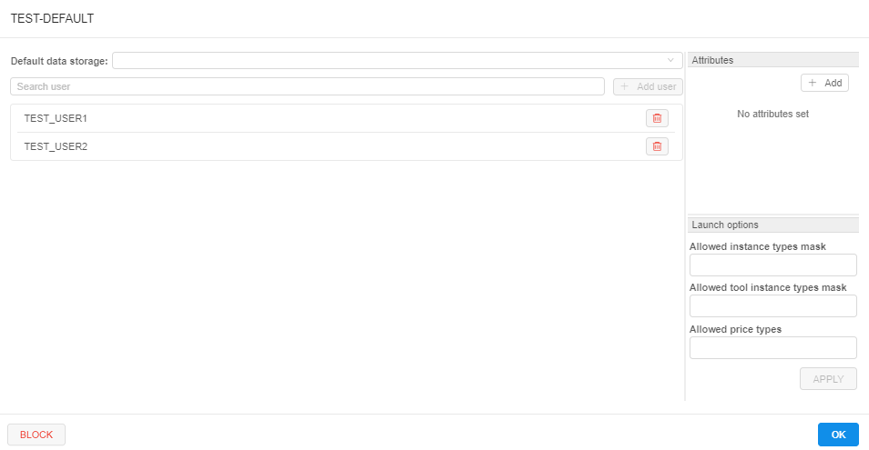
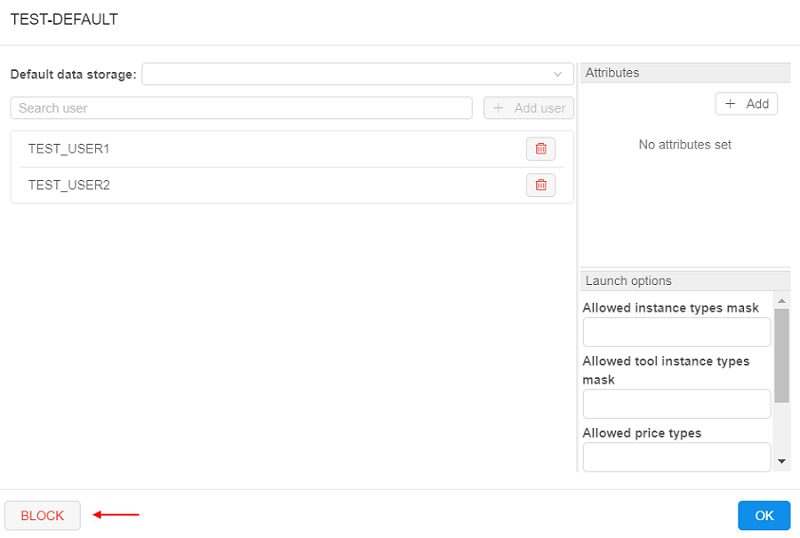
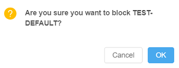
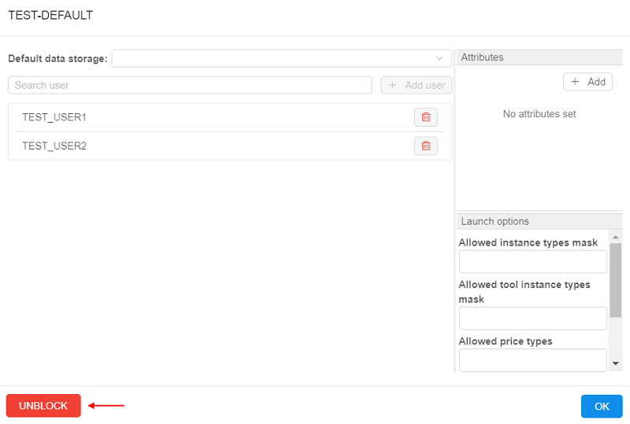
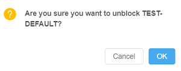

# 12.6. Edit a group (role)

- [Edit a group (role)](#edit-a-group-role)
    - [Block/unblock a group](#blockunblock-a-group)
    - [Default data storage](#default-data-storage)
    - [User management](#user-management)
    - [Attributes](#attributes)
    - [Launch options](#launch-options)

> User shall have **ROLE\_ADMIN** to edit groups/roles.

## Edit a group (role)

For edit a group/role:

1. Open **Groups/Roles** tab on **User management** section of the system-level settings.
2. Find a group (role).
3. Click **Edit** button in the row opposite the user name:  
    
4. Pop-up window will be shown:  
    

On this form there are several blocks of the settings for a group/role.

### Block/unblock a group

For block a group:

1. Open **Groups** tab on **User management** section of the system-level settings.
2. Click **Edit** button next to the group's name.   
      
    _Note_: system groups are created by the **SSO authentication system** automatically and can not be found here. 
3. Pop-up window will be shown:  
    
4. Confirm the blocking:  
    

For unblock a group:

1. Open **Groups** tab on **User management** section of the system-level settings.
2. Click **Edit** button next to the group's name.   
      
3. Pop-up window will be shown:  
    
4. Confirm the unblocking:  
    

### Default data storage

Here you can select default data storage for a group/role:  

### User management

In this block you can change a member list of the selected group/role:  

For more information see [12.8. Change a set of roles/groups for a user](12.8._Change_a_set_of_roles_groups_for_a_user.md#change-a-member-list-for-a-selected-role-or-group).

### Attributes

  
In this block you can set metadata tags (attributes) for a group. These tags represent key/value pairs, same as pipeline/folder tags. For more information see [17. CP objects tagging by additional attributes](../17_Tagging_by_attributes/17._CP_objects_tagging_by_additional_attributes.md).

### Launch options

In this block you can specify some restrictions for a group of users/role on allowed instance types and price types.
Here you can specify:

| Field | Description | Example |
|---|---|---|
| **Allowed instance types mask** | This mask restrict for a specific group/role allowed instance types for launching tools, pipelines and configurations | If you want members of a certain group/role will be able to launch runs with only "m5..." instances types, mask would be **`m5*`**:  In that case, before launching tool, pipeline or configuration, dropdown list of available node types will be look like this:  |
| **Allowed tool instance types mask** | This mask restrict for a specific group/role allowed instance types only for tools - launching from tools menu or main dashboard. This mask has higher priority for launching tool than **Allowed instance types mask**. It's meaning that in case when both masks are set - for the launching tool will be applied **Allowed tool instance types mask**. | If you want members of a certain group/role will be able to launch tools with only some of "large" "m5..." instances types, mask would be **`m5*.large*`**:  In that case, before launching tool, dropdown list of available node types will be look like this:  |
| **Allowed price types** | In this field you may restrict, what price types will be allowed for a group/role. | If you want members of a certain group/role will be able to launch "On-demand" runs only, select it in the dropdown list:  In that case, before launching tool, dropdown list of price types will be look like this:  |

To apply set restrictions for a group/role click  button.

Setting restrictions on allowed instance types/price types is a convenient way to minimize a number of invalid configurations runs.  
Such restrictions could be set not only for a group/role, but on another levels too.  
In CP platform next hierarchy is set for applying of inputted allowed instance types (sorted by priority):

- User level (specified for a user on "User management" tab) (see [v.0.14 - 12.4. Edit/delete a user](12.4._Edit_delete_a_user.md#launch-options))
- User group level (specified for a group (role) on "User management" tab. If a user is a member of several groups - list of allowed instances will be summarized across all the groups) (see [above](#launch-options))
- Tool level (specified for a tool on "Instance management" panel) (see [v.0.14 - 10.5. Launch a Tool](../10_Manage_Tools/10.5._Launch_a_Tool.md#instance-management))
- _(global)_ **`cluster.allowed.instance.types.docker`** (specified on "Cluster" tab in "Preferences" section of system-level settings) (see [v.0.14 - 12.10. Manage system-level settings](12.10._Manage_system-level_settings.md#cluster))
- _(global)_ **`cluster.allowed.instance.types`** (specified on "Cluster" tab in "Preferences" section of system-level settings) (see [v.0.14 - 12.10. Manage system-level settings](12.10._Manage_system-level_settings.md#cluster))

After specifying allowed instance types, all GUI forms that allow to select the list of instance types (configurations/launch forms) - will display only valid instance type, according to hierarchy above.  
For price type specifying - if it is set for the user/group/tool - GUI will allow to select only that price type.